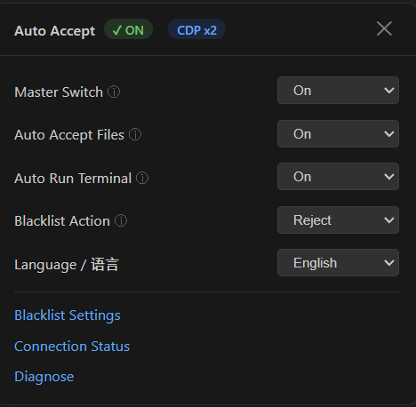

# Antigravity Auto Accept

> [English](#english) | [中文](#中文)

<p align="center">
  
</p>

**Tired of clicking "Run", "Accept All", "Allow" hundreds of times a day?** Let this plugin handle it for you — automatically accept file changes, execute terminal commands, and approve permission dialogs while you focus on what matters.

💤 **Leave it running overnight** — your Agent keeps coding while you sleep. The built-in **110+ rule blacklist** ensures dangerous commands are automatically blocked, so you can trust it to work safely unattended.

---

## English

> Automatically accept Antigravity Agent's file changes and terminal commands, with built-in dangerous command blacklist protection.

### ⚡ Features

- ✅ **Auto Accept Files** — Automatically switch tab and Accept when Agent modifies files
- ✅ **Auto Run Terminal** — Automatically click Run / Allow for Agent commands
- ✅ **Multi-target CDP** — Connect to both sidebar Agent panel and Agent Manager
- ✅ **Safe OFF** — Injected scripts fully cleaned up when disabled
- 🛡️ **Dangerous Command Blacklist** — 110+ rules (substring + regex), supports Reject or Stop
- ⚙️ **Settings Panel** — Fine-grained control for File Accept, Terminal Run, Blacklist behavior
- 🌐 **Bilingual UI** — Settings panel supports English / 中文
- 🔄 **Race Condition Protection** — Auto retry when command text hasn't rendered yet

### 🚀 Installation

#### 1. Launch Antigravity with CDP

Manually add `--remote-debugging-port=9222` to the shortcut target.

#### 2. Install the Extension

```bash
npm install
npx @vscode/vsce package --allow-missing-repository --skip-license
```

`Ctrl+Shift+P` → `Extensions: Install from VSIX...` → Select the `.vsix` file

#### ⚠️ Important

- **Do not install other auto-accept extensions** (e.g. `pesosz`) — they will conflict
- Do **not** package with `--no-dependencies`, or the `ws` module will be missing
- **Security tip**: Set **Terminal Command Auto Execution** to **Request Review** in Antigravity settings for double protection

### 📋 Usage

#### ⚠️ Prerequisites for Terminal Auto-Run

Terminal auto Run/Reject **requires Agent Manager**:

1. Open **Agent Manager** (not the sidebar Toggle Agent)
2. Enter commands in Agent Manager for the Agent to execute
3. **Keep Agent Manager open** — closing it breaks CDP connection

> Status bar shows `CDP x2` when both Agent Manager and Toggle Agent are connected.

#### Settings Panel

**Click the status bar** (bottom right) to open the settings panel:

| Item | Description |
|------|-------------|
| Master Switch | Toggle plugin on/off |
| Auto Accept Files | Toggle auto file acceptance |
| Auto Run Terminal | Toggle auto command execution |
| Blacklist Action | Reject dangerous commands or Stop plugin |
| Language / 语言 | Switch between English / 中文 |

#### 🌐 How to Switch Language

1. Click the **status bar** (bottom right) → Settings panel opens
2. Find **Language / 语言** dropdown
3. Select **English** or **中文**
4. The panel and all tooltips update immediately

#### Status Bar

| Status | Meaning |
|--------|---------|
| `✓ ON \| CDP x2` | ✅ Normal |
| `✓ ON \| CDP x1` | ⚠️ Only 1 panel connected |
| `⚠ ON \| CDP Disconnected` | ❌ Check launch parameters |
| `✕ OFF` | Disabled |

### 🛡️ Blacklist

Configure in `settings.json` (`Ctrl+,` → search `autoAccept`).

> ⚠️ Values in settings.json **override** defaults (not merge).

- **Reject**: Auto-click the Reject button, plugin continues running
- **Stop Plugin**: Skip clicking, auto-disable the plugin

### 🔧 Troubleshooting

| Issue | Solution |
|-------|----------|
| CDP Disconnected | Ensure `--remote-debugging-port=9222` is set |
| Blacklist not blocking | Run Diagnose to check debug log |
| CDP fails after packaging | Don't use `--no-dependencies` flag |

### 💬 Feedback

If you encounter any issues or have suggestions, please submit feedback on [GitHub Issues](../../issues). Thank you for your support!

---

## 中文

**每天反复点击 "Run"、"Accept All"、"Allow"，烦不烦？** 这个插件帮你全自动处理 — 文件改动自动接受，终端命令自动执行，权限弹窗自动通过。

💤 **晚上挂机睡觉，Agent 帮你写代码。** 内置 **110+ 条高危命令拦截规则**，遇到恶意命令自动阻止，无人值守也安全无忧。

> 自动接受 Antigravity Agent 的文件改动和终端命令，内置高危命令黑名单保护。

### ⚡ 功能

- ✅ **自动接受文件改动** — Agent 修改文件时自动切换 tab 并 Accept
- ✅ **自动执行终端命令** — Agent 运行命令时自动点击 Run / Allow
- ✅ **多目标 CDP** — 同时连接侧边 Agent 面板和 Agent Manager
- ✅ **OFF 安全停止** — 关闭后注入脚本完全清除
- 🛡️ **高危命令黑名单** — 预置 110+ 条规则（子串 + 正则），支持主动拒绝 (Reject) 或停止插件 (Stop)
- ⚙️ **弹出设置菜单** — 细分控制文件 Accept、终端 Run、黑名单行为
- 🌐 **中英文双语** — 设置面板可切换语言
- 🔄 **防竞态机制** — 命令文本未渲染完时自动重试，避免绕过黑名单

### 🚀 安装

#### 1. 以 CDP 模式启动 Antigravity

手动在快捷方式目标末尾加 `--remote-debugging-port=9222`

#### 2. 安装插件

```bash
npm install
npx @vscode/vsce package --allow-missing-repository --skip-license
```

`Ctrl+Shift+P` → `Extensions: Install from VSIX...` → 选择 `.vsix`

#### ⚠️ 注意

- **不要同时安装其他 auto-accept 插件**（如 `pesosz` 的），会冲突
- 打包时**不要**加 `--no-dependencies`，否则 `ws` 模块不会被包含
- **安全建议**：在 Antigravity 设置中将 **Terminal Command Auto Execution** 设为 **Request Review**，配合本插件的黑名单可以双重保护

### 📋 使用

#### ⚠️ 终端自动执行前提条件

终端命令的自动 Run/Reject 功能**必须通过 Agent Manager 窗口**运行：

1. 打开 **Agent Manager**（不是侧边栏的 Toggle Agent）
2. 在 Agent Manager 中输入命令让 Agent 执行
3. **Agent Manager 窗口不能关闭**，否则 CDP 连接会断开，自动执行失效

> 状态栏显示 `CDP x2` 表示 Agent Manager 和 Toggle Agent 都已连接。

#### 设置菜单

**点击右下角状态栏**弹出设置菜单：

| 菜单项 | 说明 |
|--------|------|
| 总开关 | 控制插件整体启停 |
| 自动接受文件改动 | 单独控制是否自动 Accept 文件 |
| 自动执行终端命令 | 单独控制是否自动 Run 命令 |
| 黑名单行为 | 选择拦截后是点击 Reject 还是停止插件 |
| 语言 / Language | 切换 English / 中文 |

#### 🌐 如何切换语言

1. 点击**右下角状态栏** → 设置面板打开
2. 找到 **语言 / Language** 下拉框
3. 选择 **中文** 或 **English**
4. 面板和所有提示文本立即更新

#### 状态栏

| 状态 | 含义 |
|------|------|
| `✓ ON \| CDP x2` | ✅ 正常 |
| `✓ ON \| CDP x1` | ⚠️ 只连了 1 个面板 |
| `⚠ ON \| CDP Disconnected` | ❌ 检查启动参数 |
| `✕ OFF` | 已关闭 |

### 🛡️ 黑名单

在 `settings.json` 中配置（`Ctrl+,` → 搜索 `autoAccept`）。

> ⚠️ settings.json 的值**覆盖**默认值（不是合并）。

- **主动拒绝 (Reject)**：自动点击 Reject 按钮，插件继续运行
- **停止插件 (Stop)**：跳过不点击，自动关闭插件

### 🔧 常见问题

| 问题 | 解决 |
|------|------|
| CDP Disconnected | 确保用 `--remote-debugging-port=9222` 启动 |
| 黑名单没拦截 | 运行诊断查看 debug log |
| 打包后 CDP 连不上 | 不要加 `--no-dependencies` |

### 💬 问题反馈

如果你遇到任何问题或有建议，请在 [GitHub Issues](../../issues) 中提交反馈，感谢你的支持！
